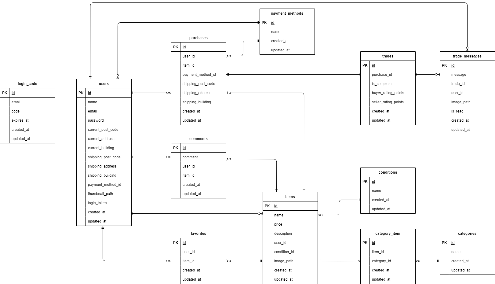

# coachtech フリマ

## 概要

このプロジェクトは、個人や小規模事業者が商品を簡単に売買できるオンラインフリーマーケットアプリケーションです。以下の機能を提供します。

- **非会員ユーザー**: 商品リストの閲覧、商品の検索、商品詳細の閲覧
- **会員ユーザー**: プロフィール編集、商品の出品、購入、コメント投稿、お気に入り機能、取引チャット機能

---

## 使用技術（実行環境）

- **OS**: Ubuntu 24.04.1 LTS
- **環境構築**: Docker 27.3.1
- **フレームワーク**: Laravel 8.x
- **プログラミング言語**: PHP 7.4.9
- **データベース**: MySQL 8.0.26
- **Web サーバー**: Nginx 1.21.1
- **バージョン管理**: Git
- **決済サービス**: Stripe
- **メール検証環境**: MailHog（ログイン認証メールと取引完了メールの確認に使用）
- **テスト環境**: PHPUnit

---

## 環境構築手順

### 1. リポジトリのクローン

```bash
git clone git@github.com:Shun-Adachi/coachtech-free-market.git
cd coachtech-free-market
```

### 2. Docker コンテナのビルドと起動

```bash
docker-compose up -d --build
```

### 3. パッケージのインストールと環境設定

```bash
docker-compose exec php bash
# コンテナ内で以下を実行
composer install
cp .env.example .env
```

`.env` ファイルを編集して以下の内容を設定してください。

```env
STRIPE_KEY=your_stripe_publishable_key # Stripeダッシュボードで確認した公開可能キーを設定
STRIPE_SECRET=your_stripe_secret_key   # シークレットキーを設定
```

- **Stripe キーの取得手順**
  1. Stripe アカウントを作成
     Stripe 公式サイトにアクセスし、新しいアカウントを登録します。
  2. API キーを取得
     Stripe ダッシュボードの「開発者」→「API キー」から、公開可能キーとシークレットキーを取得します。

### 4. 初期セットアップ

```bash
docker-compose exec php bash
# コンテナ内で以下を実行
php artisan key:generate
php artisan migrate --seed
php artisan storage:link
```

---

## URL 一覧

### 開発環境

- 商品一覧画面: <http://localhost/>
- 会員登録画面: <http://localhost/register>
- ログイン画面: <http://localhost/login>
- MailHog: <http://localhost:8025>

---

## ダミーデータ一覧

詳細は[こちら](./dummy_data.md) を参照してください。

---

## ER 図

このプロジェクトの ER 図は以下の通りです。



---

## PHPUnit を用いたテスト実行手順

### 1. テスト用データベースの作成

```bash
docker-compose exec mysql bash
# mysqlコンテナ内で以下を実行(パスワードは”root”)
mysql -u root -p

# MySQLクライアントで以下を実行
CREATE DATABASE test;
GRANT ALL PRIVILEGES ON test.* TO 'laravel_user'@'%';
FLUSH PRIVILEGES;
```

### 2. `.env.testing`ファイルの編集

`.env`ファイルをコピーし、`.env.testing`ファイルを作成して以下を設定します。

```env.testing
APP_ENV=testing
APP_KEY=

DB_DATABASE=test
```

Stripe キーも入力されていることを確認してください。

### 3. テスト用のアプリケーションキーを生成する

```bash
docker-compose exec php bash
# phpコンテナ内で以下を実行
php artisan key:generate --env=testing
php artisan config:clear
```

### 4. テストを実行する

```bash
docker-compose exec php bash
# phpコンテナ内で以下を実行
php artisan test
```

正常にテストが完了すると、以下のように表示されます。

```bash
Tests: 36 passed
Time:  x.xxs
```
